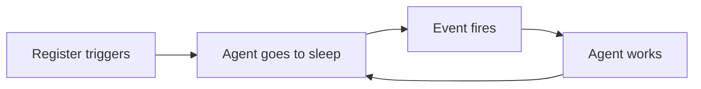

# trigr

**Make any AI coding agent autonomous.**

AI coding agents like Claude Code are **reactive**. They only do something when prompted.

OpenClaw changes that by running agents in the background, but it's a full platform you have to self-host, with [known security risks](https://www.kaspersky.com/blog/openclaw-vulnerabilities-exposed/55263/) around exposed instances and malicious plugins.

**trigr** bridges this gap through a simple trigger system. It lets the agent wait for events to autonomously run tasks when something happens. Once it's done, it goes back to sleep until the next event.

## Install

```bash
uv tool install trigr
```

## How It Works



1. **Register triggers** with `trigr add` — define CRON jobs or event pollers the agent should react to.
2. **Agent goes to sleep** by running `trigr watch`, which starts a silent background server and blocks until an event arrives.
3. **Event fires** — a message is sent, a cron job runs, or a poller detects a change.
4. **Agent works on task** — it receives the message, acts on it, then calls `trigr watch` again to go back to sleep.

### Messages

Messages are the simplest trigger. You send one from another terminal, a script, or the agent itself, and the waiting agent receives it immediately.

```bash
trigr emit "New GitHub issue opened: #1337 - Please triage."
```

You can also delay a message so the agent wakes up later.

```bash
trigr emit "Check if the deployment succeeded." --delay 20m
```

### Cron Jobs

Cron jobs fire on a schedule, like every morning at 9am. You can provide a static message or a command whose output becomes the message.

```bash
trigr add daily-news --cron "0 9 * * *" --command "python daily_news.py"
```

Or define them in `trigr.toml`:

```toml
[crons.daily-report]
cron = "0 9 * * *"
command = "echo 'time for the daily report'"
```

### Pollers

Pollers run a command at regular intervals and trigger an event when the output changes. If the command prints nothing, the cycle is silently skipped.

```bash
trigr add check-inbox --interval 300 --command "./check_email.sh"
```

Or in `trigr.toml`:

```toml
[pollers.check-inbox]
interval = 60
command = "./check_mail.sh"
```

## Commands

| Command | What it does |
|---------|-------------|
| `trigr watch [--timeout 300]` | Block until message, print it, exit |
| `trigr emit "msg" [--delay 10s]` | Send a message |
| `trigr add <name> --interval N -m "msg"` | Add a poller with a static message |
| `trigr add <name> --cron "..." -c "cmd"` | Add a cron job with a command |
| `trigr status` | Show server state |
| `trigr init` | Create `trigr.toml` (auto-created on first use) |
| `trigr serve [-f]` | Start server manually |

## Agent Compatibility

| Agent | How `trigr watch` runs | Chat while waiting? |
|-------|----------------------|---------------------|
| Claude Code | Background task | Yes |
| Codex CLI | Blocking call | No |
| Gemini CLI | Blocking call | No |

## License

MIT
